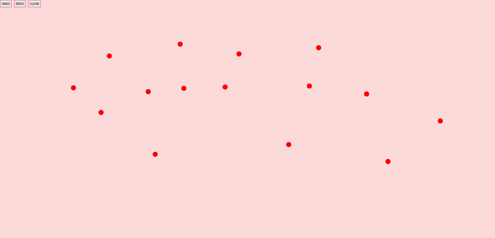

# Onclick Circles

Live website: https://fatihbulbul1.github.io/react-onclick-circles/

# Overview

Made by:
- **React**
- TypeScript

## Description 
- This is a solution for an interview question made by React TypeScript.

### Author
- LinkedIn - [Ömer Fatih Bülbül](https://www.linkedin.com/in/ömer-fatih-bülbül-74a890236/)
- Twitter - [fatihbulbul91](https://twitter.com/fatihbulbul91)